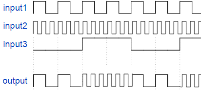

<!-- Please do not change this html logo with link -->

# Getting Started With the tinyAVR® 1-series

This repository contains training examples on the Microchip tinyAVR® 1-series. Follow the [Training Manual - Getting Started With the tinyAVR® 1-series](https://www.microchip.com/DS40001949) from Microchip for full step-by-step instructions. The training is carried out on a ATtiny817 Xplained Pro board. The projects in this repository are made in MPLAB® X IDE with MPLAB® Code Configurator (MCC). While the training manual explains steps in Atmel Studio with Atmel START, this document will go through how to complete them in MPLAB X IDE with MPLAB Code Configurator (MCC).

This training includes three assignments covering topics such as: 
- PINMUX driver configuration and check LED toggle on button press
- Generate a Pulse Width Modulation (PWM) by using Timer/Counter Type A (TCA) and implement Variable Pulse Width (VPW) by using the Real-Time Counter (RTC) interrupt
- Duty cycle and frequency measurement using input capture mode of Timer/Counter Type B (TCB)
- Universal Synchronous and Asynchronous Receiver and Transmitter (USART) configuration
- CCL (Configurable Custom Logic): A programmable logic peripheral, which can be connected to the device pins, events, or peripherals, which allows the user to eliminate external logic gates for simple glue logic functions

The code in this repository is configured using MCC Melody for all three assignments. Refer to the [Training Manual - Getting Started With the tinyAVR® 1-series](https://www.microchip.com/DS40001949) for additional information.  

## Related Documentation

- [Training Manual - Getting Started With the tinyAVR® 1-series](https://www.microchip.com/DS40001949)
- [ATtiny817 device page](https://www.microchip.com/wwwproducts/en/ATtiny817)

## Software Used

- [MPLAB® X IDE v6.20](https://www.microchip.com/en-us/tools-resources/develop/mplab-x-ide) or newer
- [MPLAB® XC8 Compiler v2.50](https://www.microchip.com/en-us/tools-resources/develop/mplab-xc-compilers) or newer
- [MPLAB® Code Configurator (MCC) v5.5.1](https://www.microchip.com/en-us/tools-resources/configure/mplab-code-configurator) or newer

## Hardware Used

- [ATtiny817 Xplained Pro](https://www.microchip.com/DevelopmentTools/ProductDetails/attiny817-xpro)
- Micro-USB cable (Type-A/Micro-B)
- One female-to-female wire
- Internet connection

## Assignment 1: LED Toggle Application

An application will be developed to control the LED using the push-button on the board. The LED will be OFF while holding the button down (default state is LED ON).

On the ATtiny817 Xplained Pro board, LED0 is connected to pin PB4, and the push-button (SW0) is connected to pin PB5.

For application:
- Peripherals used: GPIO (PB4, PB5)
- Clock: 3.33 MHz

### MCC Setup
This section shows how this example is set up in MCC. In the pin grid view, set PB4 to ouput and PB5 to input. On the ATtiny817 Xplained Pro board, these pins are connected to LED0 and SW0, respectively.

In the pins tab, name the pins and set SW0 to Pull-up.

The default setup for the CLKCTRL peripheral is used.

## Assignment 2: Generate PWM, Measure Duty Cycle

The ATtiny817 has two 16-bit Timer/Counter instances, TCA and TCB, and one 12-bit Timer/Counter, TCD.

Here, an application will be developed to generate the PWM using the TCA. The RTC interrupt will be used to vary the duty cycle of the PWM.

The TCA waveform output will be used as input to the TCB through the Event System, and the input capture mode of the TCB will be used to measure the duty cycle and the frequency of the waveform. The measured data will be sent to the terminal through the USART.

Single-Slope PWM Generation mode will be used for TCA. Here, the period is controlled by the PER register, while the values of the CMPn compare register controls the duty cycle of the waveform generated (WG) output, the WOn. The counter value is compared to the CMPx registers and the PER register to set the waveform period or pulse width.

The project from Assignment 1: LED Toggle Application will be
reconfigured to add drivers for TCA, TCB, Event System, RTC, and USART.

For the application the peripherals used are:
- TCA (waveform output WO0 on PB0)
- TCB
- Event System (event input from pin PA5)
- RTC
- USART

Clock:
- 3.33 MHz main clock
- 1 kHz RTC clock

### Physical Setup

1. Use the female-to-female wire to connect PB0 to PB4, connecting the PWM signal to LED0 on the ATtiny817 Xplained Pro. With this configuration you will see LED0 on your board switch intensity gradually down until it resets.

2. Use the female-to-female wire to connect PB0 to PA5, connecting the PWM signal to the Event System. With this configuration the ATtiny817 Xplained Pro will send the calculated duty cycle and frequency to the terminal using the USART peripheral.

### MCC Setup

An overview of the MCC setup is shown in the image below:

#### TCA
In the TCA peripheral, set the Requested Period to 30.33 &micro;s, set Waveform Generation Mode to Single Slope PWM, enable Compare Channel 0 Enable and set Duty Cycle 0 to 10. 

#### RTC
In the RTC peripheral, set Prescaling Factor to RTC Clock/32 to get a 1024 Hz RTC Clock. Set Period to 0.5 (500 ms). 

Ensure that the Overflow Interrupt Enable is enabled.

#### Interrupt Manager
In the System>Interrupt Manager, enable Global Interrupt Enable.

#### TCB
In the TCB peripheral, set Timer Mode to FRQPW (Input Capture Frequency and Pulse-Width Measurement mode) and enable Event Input Capture Enable.

#### Event System (EVSYS)
In the EVSYS peripheral, connect GENERATORS>ASYNCCH0>PORTA_PIN5 to the CHANNELS>ASYNCCH0, then further connect CHANNELS>ASYNCCH0 to USERS>TCB0.

#### USART
In the USART, enable Redirect Printf to UART.

In the USART0_Peripheral disable Enable USART Receiver since the receiver is not used.

## Assignment 3: Basis of a Binary Frequency-Shift Keying Scheme

The CCL module is a programmable logic peripheral, which can be connected to the pins, events, or peripherals on the device. It allows the user to eliminate external logic gates for simple glue logic functions.

In this assignment, a small CCL-based application will be developed. It will blink an LED at two different frequencies depending on whether a button is depressed or not. Two pulse trains of different frequencies will be generated and routed to the CCL. The CCL will be configured to select which of the pulse trains to
pass on to the output based on the state of a third input signal as shown in the image below.

CCL Input/Output Waveform

Here, output = input1 when input3 is LOW, and output = input2 when input3 is HIGH.

The application can be the basis of a binary frequency-shift keying scheme that encodes binary data as discrete shifts between two frequencies.

So, in this application:
- "input1" is the PWM signal generated using TCA in Assignment 2
- "input2" event output from PIT
- "input3" is button state (SW0)
- "output" is CCL output on pin PA7

The LED will be connected to PA7 and blink with different frequencies on button press and button release.

The RTC peripheral offers two timing functions; the Real-Time Counter (RTC) and a Periodic Interrupt Timer (PIT). The PIT functionality can be enabled independent of the RTC functionality.

By using the same clock source as the RTC function, the PIT can request an interrupt or trigger an output
event on every nth clock period. n can be selected from {4, 8, 16,.. 32768}. Here the Event System will be configured to output events from the PIT. The event signals from the PIT has the form of clock signals with periods corresponding to the respective number of the RTC clock periods. This application uses the event signal corresponding to 8192 RTC clock periods. The event signal from the PIT has a frequency of 32 kHz/8192 = 3.9 Hz (period approximately 250 ms).

The project from Assignment 2 will be reconfigured to add the CCL driver and edit the Event System and RTC driver.
For this application, the peripherals used are:
- TCA (waveform output WO0 on PB0)
- PIT (event output)
- CCL (output PA7)
- Event System
- PB5 (SW0)

Clock details:
- 3.33 MHz main clock
- PIT 32 kHz

### Physical Setup

1. Use the female-to-female wire to connect PA7 to PB4, connecting the CCL output signal to LED0 on the ATtiny817 Xplained Pro. LED0 will switch intensity gradually down until it resets. When the button is held down LED0 will blink with a approximate frequency of 3.9 Hz.

### MCC Setup

An overview of the MCC setup used in Assignment 3 is shown in the image below. Remaining peripherals from Assignment 2 can be deleted or just left as is. TCA0 is used with the same setup as Assignment 2.

#### CCL
In the CCL peripheral, go to the LUT1 settings. Enable LUT and Enable LUT output. Set Input 0 Source Selection to TCA0, Input 1 Source Selection to Event1 and Input 2 Source Selection to Event0. Set Gate Type to Custom and enter in the truth table or set the OUT result to 0xac.

#### Event System (EVSYS)
In the EVSYS peripheral, connect GENERATORS>ASYNCCH1>PORTB_PIN5 to the CHANNELS>ASYNCCH1, then further connect CHANNELS>ASYNCCH1 to USERS>CCL LUT1 Event 0. Also connect GENERATORS>ASYNCCH3>PIT_DIV8192 to the CHANNELS>ASYNCCH3, then further connect CHANNELS>ASYNCCH3 to USERS>CCL LUT1 Event 1.

#### RTC
In the RTC peripheral, enable PIT Enable in the Periodic Interrupt Timer.

## Operation

1. Connect the ATtiny817 Xplained Pro board to the PC using the USB cable.

2. Download the zip file or clone the example to get the source code.

3. Open the project in MPLAB X IDE.

4. For Assignment 2 and 3, connect the female-to-female wire according to the Physical Setup.

5. Build the solution and program the ATtiny817. 

## Conclusion
 This training exercise demonstrated the different peripherals of the tinyAVR 1-series, how to use the Event System to generate an Event and how to use CCL to generate an output.
